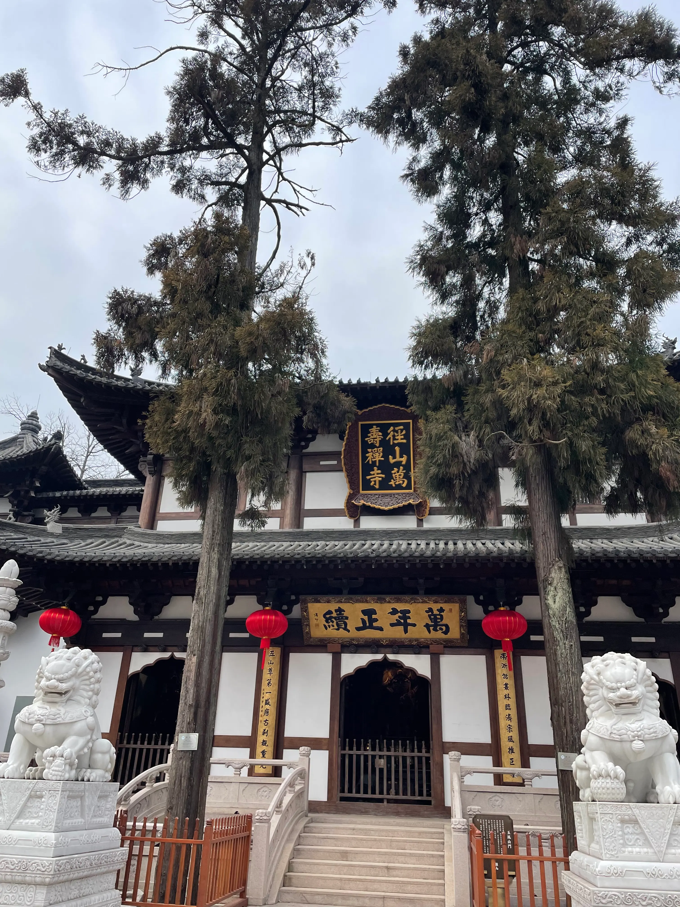
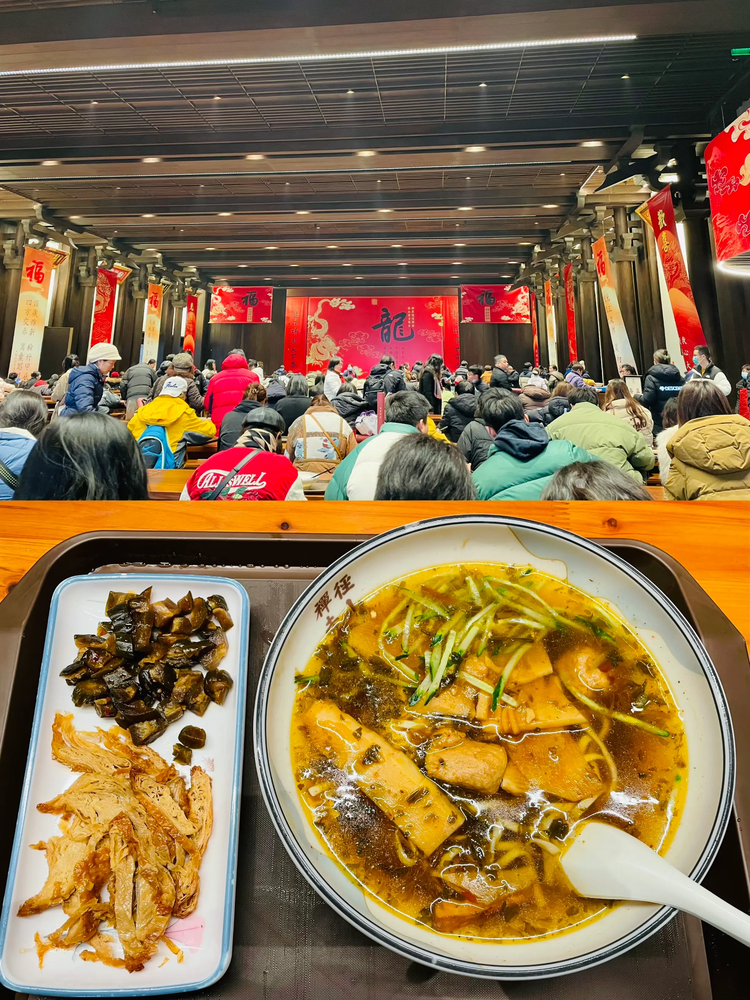

听同事说径山寺求事业比较灵，本来2周前就计划要去的，因为各种延期两次今天终于成行。径山寺之前也来过两次了，上次来应该是前年过年的时候，那时候山上积雪挺大，景色还是挺好的。今天的天气就不算太好，温度低加上一直没有太阳，体感上就比较冷。

因为到山上已经11点半，我们直接去吃斋面，之前两次都没吃到，这次排了5分钟左右终于是吃到了。点了两份素面和一份小菜，素面味道还是挺不错的（就是太不顶饿了，下午2点就饿了😑）。

吃完面在寺庙里面各种拜，中途看到有抄经书的项目，跟老婆一起体验了下，原来以为是对着抄，没想到是临摹，不过对于我这种多年不写字的人来说反倒是方便了。

我的字太烂了，及时临摹也很丑😄

一些随拍

