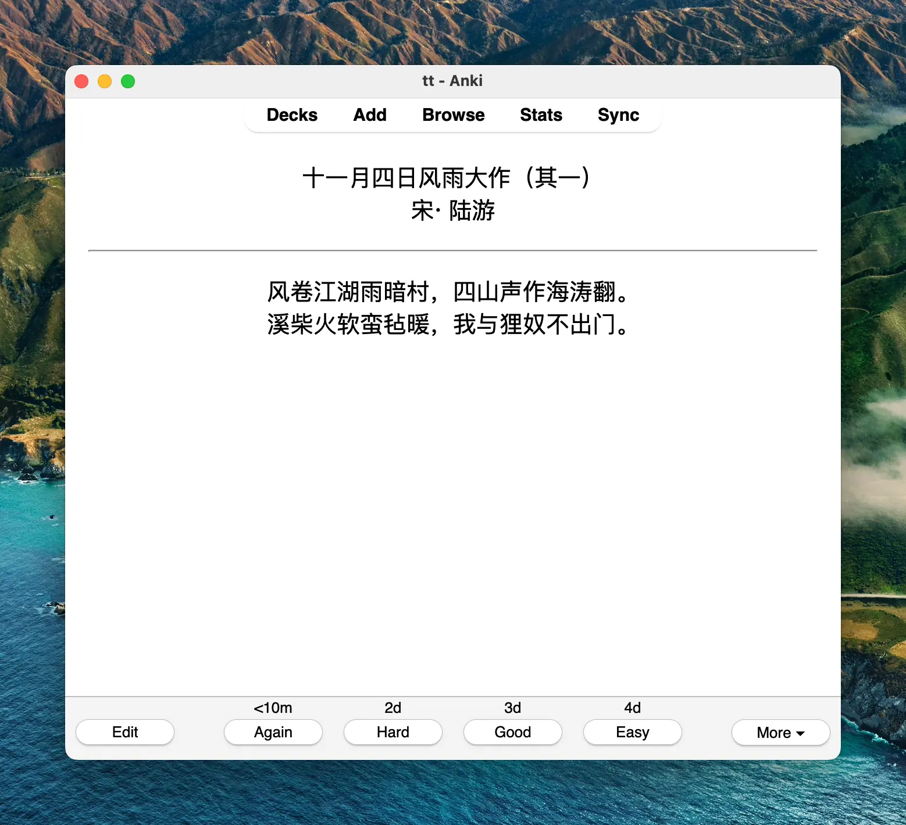

近期一直在用Anki几点东西，但是Anki制卡的过程太繁琐，之前一直在用Obsidian仓库的 [Obsidian_to_Anki](https://github.com/ObsidianToAnki/Obsidian_to_Anki)制卡，整体上还是不错的，但是也有几个让人不太满意的地方。

一是 Obsidian_to_Anki 每次同步是整个Vault全量扫描同步，这个如果笔记多就会很慢。为了解决这个问题，我专门开了一个 Anki的Vault出来算是勉强绕过去。但实际情况是即使单独的Vault，如果卡片笔记足够多每次同步还是很慢。

第二个问题就是有些卡片同步不了，这个是真的让我想自己折腾的直接原因。也不知道啥原因同样的制卡笔记，有时候同步不了，但是下一次可能又行了，还有一些是怎么折腾都同步不了。这个是真的搞的我很不爽，为了搞定这个还专门把 Obsidian_to_Anki 的源码翻了下也没看到多少端倪。Obsidian_to_Anki 为了通用大量用了正则做匹配替换，这里排查起来就很头疼，我对JavaScript又不是很熟，也想通过改正则来解决，最后也没搞定。

前两天搞的烦了就想为啥不自己弄，我又不需要做一个通用工具，只要按照自己的需求简单实现就好了。我的制卡笔记也非常的简单，简单的文本查找应该就能搞定。

决定之后就是实现了，为了简单肯定用python了，但是我python也不是太熟😹。不过不是还有GPT吗，通过一个prompt把核心代码就生成好了。

代码生成Prompt：
```markdown
I want you to act as a computer expert，your task is to write python code to extract flash card from markdown and send it to anki. 
## steps:
1. extract front and back value from markdown file path
2. if content matches `![xxx]`, you should extract xxx value
2. convert front and back value to html, replace `![xxx]` to ``
3. connect to anki with ankiconnect
3. create Basic card with front and back value

## markdown content example
```观放白鹰二首 
唐⋅ 李白 #flashcard 

【其一】 
八月边风高，胡鹰白锦毛。 
孤飞一片雪，百里见秋毫。 
【其二】 
寒冬十二月，苍鹰八九毛。 
寄言燕雀莫相啅，自有云霄万里高。

---

十一月四日风雨大作（其一）
宋⋅ 陆游 #flashcard 

风卷江湖雨暗村，四山声作海涛翻。 
溪柴火软蛮毡暖，我与狸奴不出门。

---```

## attention
1. markdown contains multiple cards seperate by `---`
2. content before `#flashcard` is front value, after is back value
3. back value is markdown text, you should convert it to html

```

生成的代码整体质量还不错，简单修复一些问题后已经达到能用的状态了。不过生成的python代码太过程试有点不是很满意，又让GPT重构成更简洁和面向对象的风格，同时增加参数解析。最终生成的代码效果还不错，感觉让我自己来写这个代码可能还没它写的好😛。

脚本的执行效果：

```bash
usage: anki2.py [-h] [--deck_name DECK_NAME] [--model_name MODEL_NAME] [--debug] vault_path note_path

Sync Obsidian flashcards with Anki

positional arguments:
  vault_path            The file path to the Obsidian vault
  note_path             The path to the note folder within the vault

options:
  -h, --help            show this help message and exit
  --deck_name DECK_NAME
                        The name of the Anki deck (optional)
  --model_name MODEL_NAME
                        The name of the Anki model (optional)
  --debug               Enable debug logging
```



Code：[markdown-to-anki](https://github.com/linq/markdown-to-anki/tree/main)
